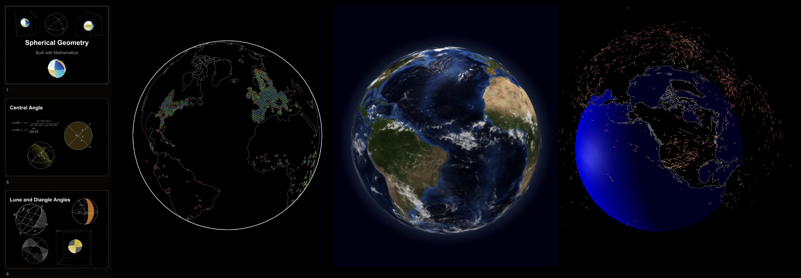
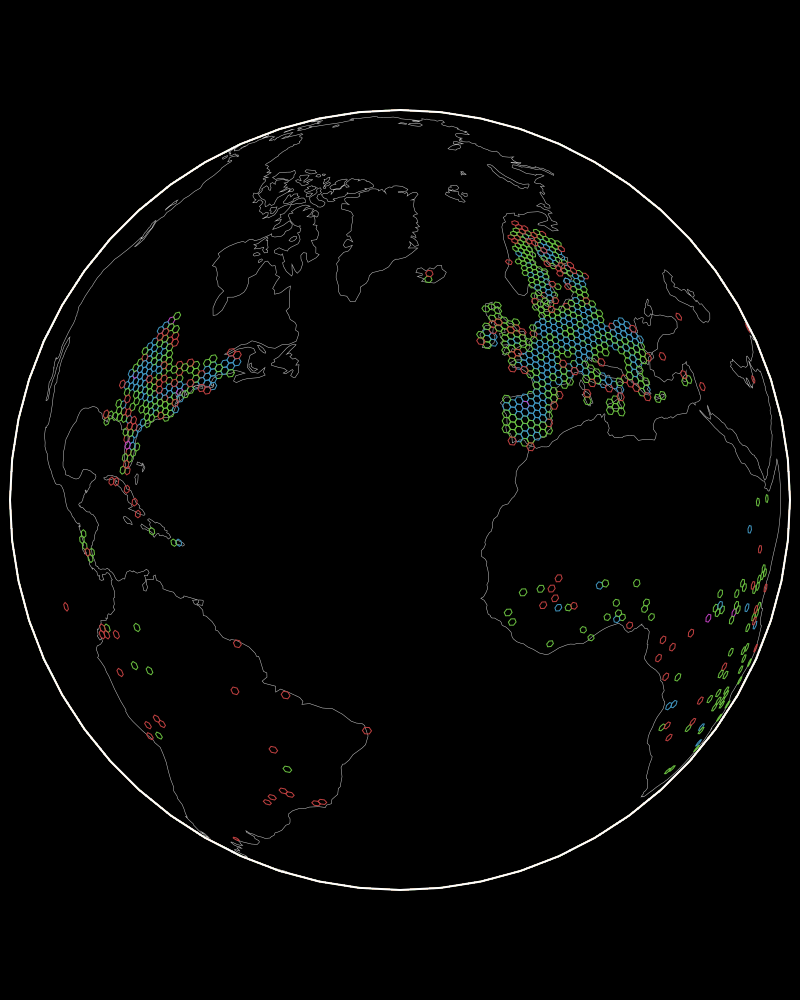

# Welcome
Hello, I'm Tim.

Software and Mathematics are a life long process of learning for me. This site has a small collection of my work, and work that builds on open source. To sign up for my course see (https://timcash.io)

# Services I offer
1. Robotic Cell Design and Deployment
1. Machine Learning for Robotic Tasks
1. Data Engineering
1. Lean Product Development
1. Software Architecture
1. Cloud Architecture
1. Automated Testing
1. Geospatial Intelligence
1. Web Applications
1. Graph Databases & Knowledge Graphs
1. Network Architecture
1. Data Visualization

# Subjects I Enjoy Teaching
1. Generative Art & Music
1. Geospatial Systems
1. Cloud Architecture
1. Machine Learning
1. Deep Neural Networks
1. Genetic Algorithms
1. Automated Testing
1. Software Engineering
1. Continuous Integration
1. Video and Image Processing
1. Full Stack Web Applications
1. Numerical Simulations and Games
1. Disrupting Communication Networks
1. Category Theory
1. Partial Differential Equations
1. Linear Algebra
1. Calculus
1. Probability and Statistics
1. Discrete Mathematics
1. Algorithms
1. Computer Science

## Global Soil Data Study

- Global soil sample data streamed into geoJSON
- [Soil Spectroscopy](https://github.com/mejia-code/soil_data_research)

# Technologies Deployed to Production
1. Web - Javascript, Nodejs, React, web-componets
1. Cloudflare - Workers, KV
1. AWS - SQS, Lamda, S3, API Gateway, EC2
1. GCP - BigQuery, PubSub, Compute Engine, Cloud Storage, App Engine
1. DevOps - Saltstack, Pulumi
1. Data - ElasticSearch, Redis, Postgres, Cassandra, Oracle, Kafka
1. Microsoft - C#, .NET
1. Golang - https://ebitengine.org/
1. Python - Flask, Django, Matplotlib
1. Data visualization - Matplotlib, d3
1. Geo-spatial - mapbox, turf, deck.gl, globe.gl, d3
1. Graph analysis - cytoscape.js
1. Architecture BIM & CAD - IFC.js, three.js 
1. User Interfaces - react, web-componets
1. P2P networks - hypercore, ipfs
1. UX Testing - Playwright
1. Point Clouds - Potree

# Geospatial Community Experience
1. Intelligence Operations
1. Geospatial Analysis
1. Synthetic Aperture Radar
1. Mission Planning
1. Signals Intelligence
1. Social Network Analysis
1. Measurement and Signature Intelligence (MASINT)

# Patents
### Adaptive Processing and Content Control System
- DOCUMENT ID US 20210064812 A1
- DATE PUBLISHED 2021-03-04

# 1:1 Math & Software Tutoring
See https://timcash.io for more information

## Learning 1 on 1 and pair programming
Building together can greatly accelerate learning. A small amount of time a few days a week practicing a skill. Live feedback, ambient learning, and exploration supported by mentors are keys to immersive education.

# Development Style
1. Keep it simple - did you ship something?
1. Pair Programming & Team Programming
1. Test Driven Design
1. Continuous Integration and Delivery
1. Testing in Production

# Libraries and Open Source Projects
### Binary Search Tree (BST)
- Simple Binary Search Tree implementation in Javascript
- [Binary Search Tree bst.js](https://github.com/timcash/bst.js)
### Tools for modding openai codex
- [openai codex mods](https://github.com/timcash/openai2)
### Soil Spectroscopy database loader and geospatial plot
1. Nodejs sqllite d3 and h3.js
1. Generates GeoJSON for visualizing soil data
- [soil soilspectroscopy](https://github.com/mejia-code/soil_data_research)
## Small hackable nodejs http server 
1. Great for quick mods and 
1. Easy to manipulate etags, cookies, and headers
1. Teach others about testing and the web
- [small_http](https://github.com/timcash/small_http)

## Sign up for my course                   
- [Hour based 1:1 Maths and Software training](https://buy.stripe.com/4gw29YguIc2Of7i7sv)
- [Full Stack 1:1 Engineering Course](https://buy.stripe.com/aEUaGudiwaYK2kwaEI)

# Other projects

## Javascript Workshops

1. [Declarative Techniques](https://github.com/timcash/declarative_workshop_2)
2. [Async Patterns](https://github.com/timcash/async_workshop)
3. [Hypercore Protocol](https://github.com/timcash/hyperspace-demo)

## Javascript Published Packages
A mix of projects with myself as a core author
1. [Failables](https://www.npmjs.com/package/@pheasantplucker/failables)
1. [Google Cloud Platform](https://github.com/pheasantplucker)
1. [GCP Datastore](https://github.com/pheasantplucker/gc-datastore/blob/master/src/datastore.test.js)
1. [GCP PubSub](https://github.com/Oakleon/oakpubsub)
1. [Mars Rover](https://github.com/timcash/rover_hp)

## Medium size team project on GCP
Demostrates all the research and coordination around launching a project as a team on GCP.
1. [Event processing job streams](https://github.com/autotrons/starspawn)

## Writing & Presentations

1. [Node.js in Production](https://www.pluralsight.com/tech-blog/running-node.js-in-production/)
1. [Spherical Geometry](https://docs.google.com/presentation/d/1YeShF6Huqa8Gg0dKxskW1gGaoNqe31cqKSqKVMIVCGw/edit?usp=sharing)
1. [Differential Equations](https://docs.google.com/presentation/d/1Oc3AyjkWyo-G3qGuagkPAGsdL5h7fWBMhZSXRufmAMA/edit?usp=sharing)

## Math + Code sketch

These are written with friends and colleagues in mind. The code was written as a discussion. The coloring algorithm for mandlebrot is facinating

1. [Mandelbrot](https://github.com/timcash/mandlebrot)
1. [Lorenz](https://github.com/timcash/lorenz)
1. [Mutli Circles](https://github.com/timcash/multicircles)

# Chromatic Systems

> https://chromatic.systems

## Numbers come in many forms

> A study of complex numbers, fractals and coloring algorithms. Written from scratch in javascript. The coloring algorithm was challenging and fun.

## Stream and image of mars rover cameras

