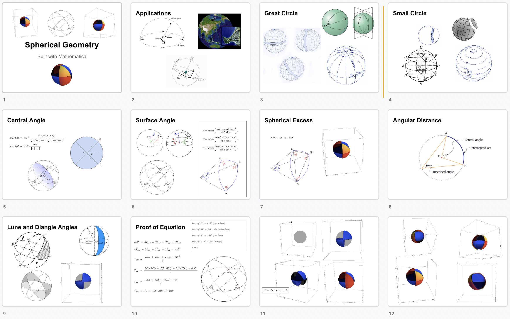
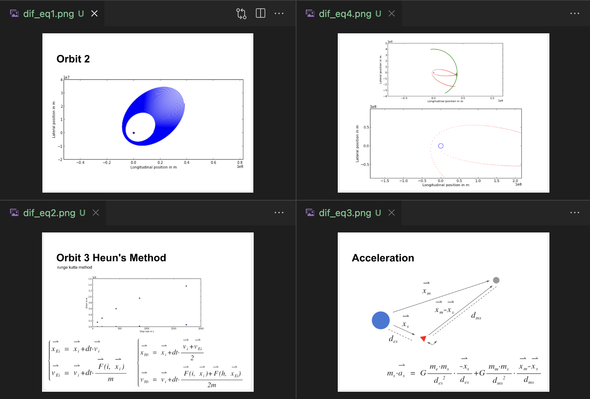
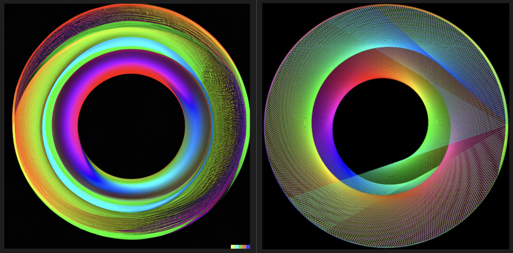
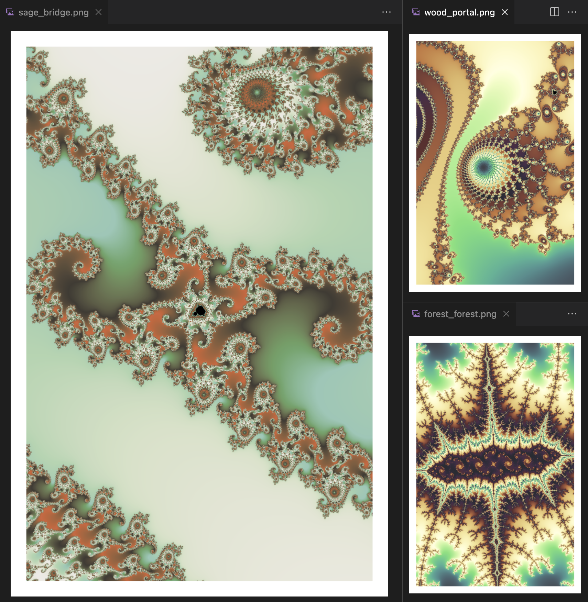

# Welcome
Hello, I'm Tim. Software and Mathematics are a life long process of learning for me. This site has a small collection of my work, and work that builds on others (OSS). My partner and I are looking for other learners to join us. We teach via discord or keet.io in the evenings GMT-5. 

## Overview
1. Some Professional Highlights
1. OSS Libraries and Studies
1. Chromatic Systems our school for geospatial data and mathematics

# Technologies Deployed to Production
* Web - Javascript, Nodejs, React, web-componets
* Cloudflare - Workers, KV
* AWS - SQS, Lamda, S3, API Gateway, EC2
* GCP - BigQuery, PubSub, Compute Engine, Cloud Storage, App Engine
* DevOps - Saltstack, Pulumi
* DB - ElasticSearch, Redis, Postgres, Cassandra, Oracle, Kafka
* C#, .NET
* Python

# I enjoy working with these open source projects
1. Data visualization - Matplotlib, d3
1. Geo-spatial - mapbox, turf, deck.gl
1. Graph analysis - cytoscape
1. Architecture BIM & CAD - IFC.js, three.js 
1. User Interfaces - react, web-componets
1. P2P networks - hypercore, ipfs
2. Testing - Playwright

## Geospacial Systems with Open Source

> Global soil sample data streamed into sqllite and transformed into geoJSON

# Areas of Expertise
## Software Architecture
1. Engineering Leadership
1. Cloud Architecture
1. Automated Testing
1. Data Engineering
1. Geospatial Modeling
1. Web Applications
1. HTTP Servers
1. Graph Databases
1. Network Architecture
1. Data Visualization

## US Intelligence Community
1. Intelligence Operations
1. Geospatial Analysis
1. Synthetic Aperture Radar
1. Tactical Communications
1. Mission Planning
1. Signals Intelligence
1. Measurement and Signature Intelligence (MASINT)
1. Social Network Analysis

# Patents
### ADAPTIVE PROCESSING AND CONTENT CONTROL SYSTEM
- DOCUMENT ID US 20210064812 A1
- DATE PUBLISHED 2021-03-04

# Custom 1:1 instruction
See https://timcash.io for more information

## Why learning 1 on 1 and pair programming
Building together can greatly accelerate learning. A small amount of time a few days a week practicing a skill. Live feedback, ambient learning, and exploration supported mentors are keys to immersive education. The purpose of this system is to spark creativity and continuous re-categorification of knowledge.
- We use our own private self hosted encrytped network. 
- During the class you make a key!

1. Generative Art & Music
1. Geospatial Systems
1. Cloud Architecture
1. Machine Learning
1. Deep Neural Networks
1. Genetic Algorithms
1. Automated Testing
1. Software Engineering
1. Continuous Integration
1. Video and Image Processing
1. Full Stack Web Applications
1. Numerical Simulations and Games
1. Disrupting Communication Networks
1. Category Theory
1. Partial Differential Equations
1. Linear Algebra
1. Calculus
1. Probability and Statistics
1. Discrete Mathematics
1. Algorithms
1. Computer Science

# How We Code
1. Keep it simple - did you ship something?
1. Pair Programming & Team Programming
1. Test Driven Design
1. Continuous Integration and Delivery
1. Testing in Production

## tools for modding openai codex
- [openai codex mods](https://github.com/timcash/openai2)
## Soil Spectroscopy database loader and geospatial plot
- nodejs sqllite d3 and uber h3 for generating geoJSON and visualizing soil data
- [soil soilspectroscopy](https://github.com/mejia-code/soil_data_research)

## small nodejs http server 
for quick mods and teaching others about testing and the web
- [small_http](https://github.com/timcash/small_http)

## Sign up for our course                   
- [Hour based 1:1 Maths and Software training](https://buy.stripe.com/4gw29YguIc2Of7i7sv)
- [Full Stack 1:1 Engineering Course](https://buy.stripe.com/aEUaGudiwaYK2kwaEI)

## Join our discord
https://discord.gg/v4CCkcVC

## Personal Site
https://timcash.io
- building it from scratch with no frameworks for fun.

# Other projects

## Javascript Workshops

1. [Declarative Techniques](https://github.com/timcash/declarative_workshop_2)
2. [Async Patterns](https://github.com/timcash/async_workshop)
3. [Hypercore Protocol](https://github.com/timcash/hyperspace-demo)

## Javascript Published Packages
A mix of projects with myself as a core author
1. [Failables](https://www.npmjs.com/package/@pheasantplucker/failables)
1. [Google Cloud Platform](https://github.com/pheasantplucker)
1. [GCP Datastore](https://github.com/pheasantplucker/gc-datastore/blob/master/src/datastore.test.js)
1. [GCP PubSub](https://github.com/Oakleon/oakpubsub)
1. [Mars Rover](https://github.com/timcash/rover_hp)

## Medium size team project on GCP
Demostrates all the research and coordination around launching a project as a team on GCP.
1. [Event processing job streams](https://github.com/autotrons/starspawn)

## Writing & Presentations

1. [Node.js in Production](https://www.pluralsight.com/tech-blog/running-node.js-in-production/)
1. [Spherical Geometry](https://docs.google.com/presentation/d/1YeShF6Huqa8Gg0dKxskW1gGaoNqe31cqKSqKVMIVCGw/edit?usp=sharing)
1. [Differential Equations](https://docs.google.com/presentation/d/1Oc3AyjkWyo-G3qGuagkPAGsdL5h7fWBMhZSXRufmAMA/edit?usp=sharing)

## Math + Code sketch

These are written with friends and colleagues in mind. The code was written as a discussion. The coloring algorithm for mandlebrot is facinating

1. [Mandelbrot](https://github.com/timcash/mandlebrot)
1. [Lorenz](https://github.com/timcash/lorenz)
1. [Mutli Circles](https://github.com/timcash/multicircles)

# Chromatic Systems
## A School for Geospatial Systems Software and Mathematics on Encrypted Peer-to-Peer Networks

> ML variation (left) Our algorithm (right)

## Project Background
Samples of integrating popular open source libs to get students up to speed quickly on contributing to real systems.
https://chromatic.systems

## Numbers come in many forms

> A study of complex numbers, fractals and coloring algorithms. Written from scratch in javascript. The coloring algorithm was challenging and fun. Three hours of code into this program taught me more than three months of college algebra.

## Stream and image of mars rover cameras

